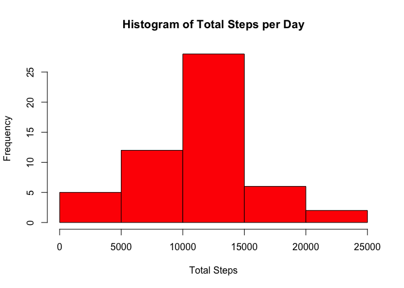
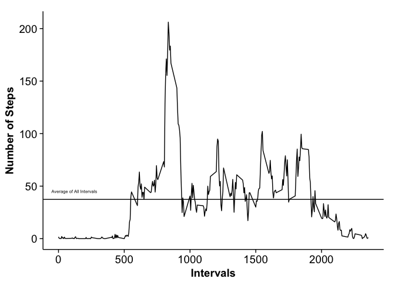
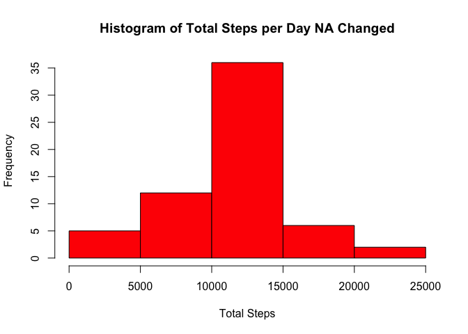
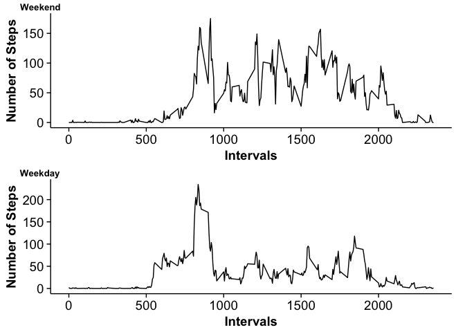

# Reproducible Research: Peer Assessment 1
Al Anderson  
7/11/2015  

## Project Requirements
You must meet several requirements to reproduce the project.

1. You must have an Internet connection to download the data
2. You must have the dplyr, readr, ggplot2, and cowplot libraries installed

```r
library(readr)
library(dplyr)
library(ggplot2)
library(cowplot)
options(scipen = 1, digits = 2) ##Sets some options so our in-line code prints out numbers correctly
```

## Loading and preprocessing the data
This code downloads the activity.csv file containing the raw data for this project. It also converts it to a dplyr datab frame tbl.


```r
temp  <- tempfile()
download.file("http://d396qusza40orc.cloudfront.net/repdata%2Fdata%2Factivity.zip", temp, mode = "wb")
unzip(temp,"activity.csv")
dt <- read_csv("activity.csv", col_types = "ncn")
mydf <- tbl_df(dt)
rm("dt")
```

## What is mean total number of steps taken per day?
To get the total number of steps per day we group the data by day. The code below accomplishes this using the dplyr `group_by` function. We save a summarization of the sum for each day in the step_summarized_by_date variable.


```r
by_date <- group_by(mydf, date)
step_summarized_by_date  <- summarise(by_date, 
                                      total_steps = sum(steps))
```
Here is the first 10 days of data.

```r
head(step_summarized_by_date)
```

```
## Source: local data frame [6 x 2]
## 
##         date total_steps
## 1 2012-10-01          NA
## 2 2012-10-02         126
## 3 2012-10-03       11352
## 4 2012-10-04       12116
## 5 2012-10-05       13294
## 6 2012-10-06       15420
```
A histogram is plotted of the total steps for each day.

```r
hist(step_summarized_by_date$total_steps, 
     xlab = "Total Steps" , 
     main = "Histogram of Total Steps per Day", 
     col = "red")
```

 

To calculate the mean for the total steps per day, we call `mean(step_summarized_by_date$total_steps, na.rm = TRUE)` giving us 10766.19. To calculate the median of the total steps per day, we call `median(step_summarized_by_date$total_steps, na.rm = TRUE)` giving us 10765.

## What is the average daily activity pattern?


```r
by_interval  <- group_by(mydf, interval)
interval_mean <- summarise(by_interval, 
                           mean=mean(steps, 
                                     na.rm = TRUE))
```

```r
ggplot(data=interval_mean, 
       aes(x=interval, y=mean)) + geom_line() +   
       geom_hline(aes(yintercept=mean(interval_mean$mean))) +
       annotate("text", x = 120, y = 45, label = "Average of All Intervals", size = 2) +
       labs(x = "Intervals", y = "Number of Steps")
```

 


```r
interval_mean[which.max(interval_mean$mean),1]
```

```
## Source: local data frame [1 x 1]
## 
##   interval
## 1      835
```


## Inputting missing values

The total number of records with **NA** in the step column is 2304.

This code replaces the **NA**s with the mean for that particular interval.

```r
summarized_by_interval  <- summarize(by_interval, 
                                     step_mean = mean(steps, 
                                                      na.rm = TRUE))
mydf2 = mydf
for(i in 1:nrow(mydf2)){
    if(is.na(mydf2[[i,1]])){
      tmp <- summarized_by_interval[which(summarized_by_interval$interval == mydf2[[i,3]]),2]
      mydf2[i,1] <-  tmp
    }
}
```
This is a histogram of the Total Steps per Day with the **NA**s replaced with the mean of the interval.

```r
by_date2 <- group_by(mydf2, date)
step_summarized_by_date2 <- summarise(by_date2, 
                                      total_steps = sum(steps))
hist(step_summarized_by_date2$total_steps, 
     xlab = "Total Steps" , 
     main = "Histogram of Total Steps per Day NA Changed", 
     col = "red")
```

 

To calculate the mean for the total steps per day, we call `mean(step_summarized_by_date2$total_steps, na.rm = TRUE)` giving us 10766.19. To calculate the median of the total steps per day, we call `median(step_summarized_by_date2$total_steps, na.rm = TRUE)` giving us 10766.19.

Changing the **NA**s to the mean of the interval changed the histogram by increasing the number of steps in a given interval but not the relative relationship between the columns. The modification did not change the mean or median. This makes sense because we changed the **NA**s to the mean of that particular interval where the mean is calculated as 
$$ i = \text{number of days for a given interval} $$
$$ s = \text{steps in an given interval} $$
$$ mean_{interval} = \frac{\sum_{n=1}^{i} s}{i} $$ 
by changing the **NA**s to the mean of the interval we also are adding another interval giving us a mean for a particular interval
$$ j = \text{number of days for a given interval where NA changed} $$
$$ mean_{interval} = \frac{\sum_{n=1}^{i+j} s}{i+j} $$ 
since the number of steps in the intervals where the **NA**s where changed is simply the mean, there will be no change to the total interval mean except that the number of intervals is increased by the number of intervals, $j$, where the **NA**s have been changed.


## Are there differences in activity patterns between weekdays and weekends?
This code splits our data frame into weekend and weekday data frames. This is done by using the `weekdays()` function to determine the weekday then setting a new variable column called day_of_week to "Weekend" or "Weekday" depending on what the day of week is.

```r
mydf2 <- mutate(mydf, 
                day_of_week = ifelse (weekdays(as.Date(date)) %in% 
                                              c("Saturday", "Sunday"),"Weekend","Weekday"))

mydf2$day_of_week <- as.factor((mydf2$day_of_week))

weekday_data <- filter(mydf2, day_of_week == "Weekday")
weekend_data <- filter(mydf2, day_of_week == "Weekend")

by_interval_weekday  <- group_by(weekday_data, interval)
interval_mean_weekday <- summarise(by_interval_weekday, 
                           mean=mean(steps, 
                                     na.rm = TRUE))

by_interval_weekend  <- group_by(weekend_data, interval)
interval_mean_weekend <- summarise(by_interval_weekend, 
                           mean=mean(steps, 
                                     na.rm = TRUE))
```

In the plots below it is clear that there is more activity across the intervals, i.e. during the day, on the weekends compared to the weekdays. On the weekdays, there is increased activity in the morning intervals but less in general during the rest of the day.

```r
p1 <- ggplot(data=interval_mean_weekday, 
       aes(x=interval, y=mean)) + geom_line() +   
       labs(x = "Intervals", y = "Number of Steps")

p2 <- ggplot(data=interval_mean_weekend, 
       aes(x=interval, y=mean)) + geom_line() +   
       labs(x = "Intervals", y = "Number of Steps")
plot_grid(p2,p1, labels = c("Weekend", "Weekday"), label_size = 10, ncol=1, nrow = 2)
```

 


